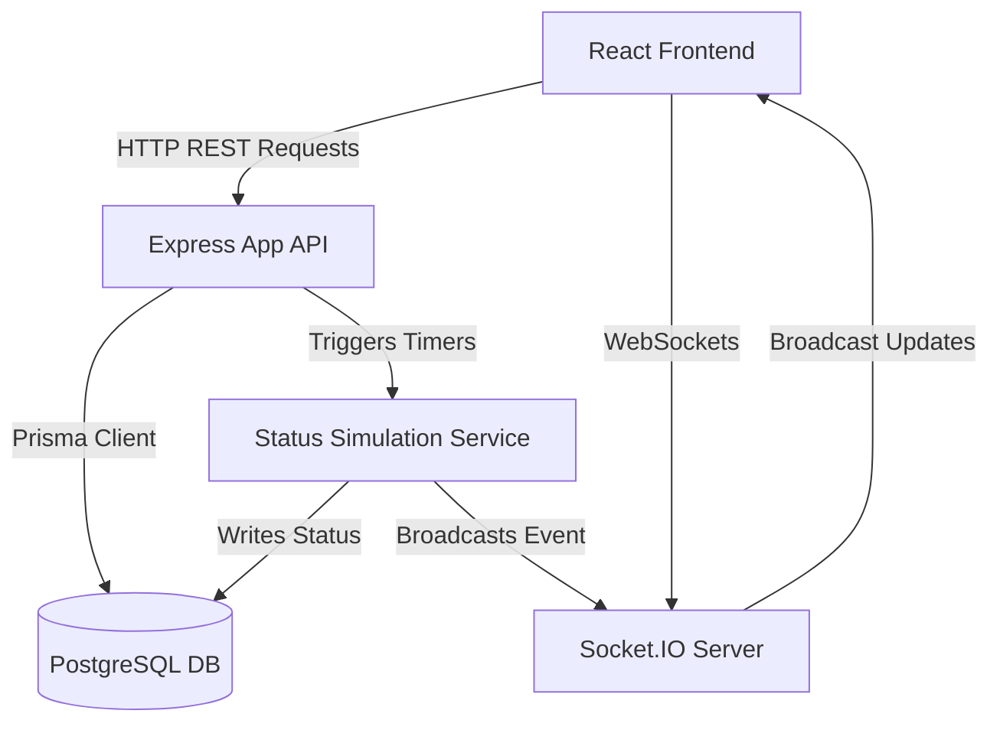
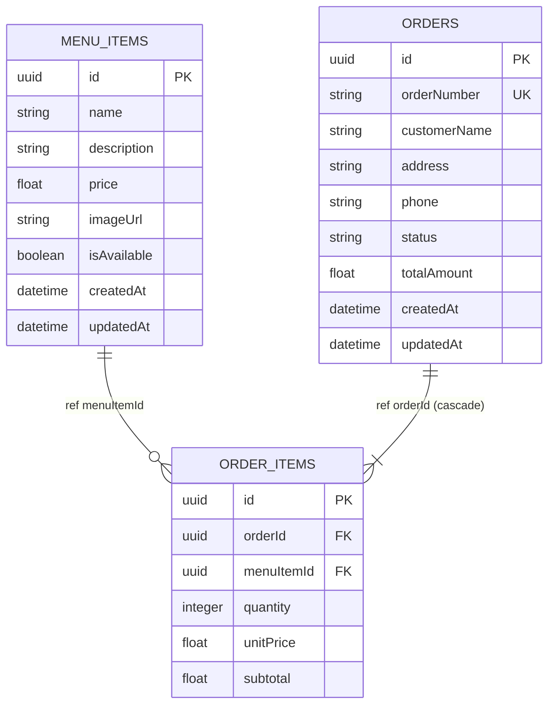

# Architecture Overview

This document outlines the architecture, directory structure, and technical flows of the BiteDash Order Management application.

---

## High-Level Architecture

The project is structured as a modular client-server monorepo that separates the frontend (React + Vite) and the backend (Node.js + Express + Socket.IO + Prisma ORM).

### 1. Monorepo Organization
- **`/client`**: Frontend SPA bootstrapped with Vite, React, and React Router. Serves the Menu, Cart, Checkout, and Tracking views.
- **`/server`**: Backend Express REST API server and Socket.IO dispatcher. Incorporates Prisma ORM connected to PostgreSQL.
- **`/docs`**: Project assessments documentation, including API specs, testing layouts, and code walkthroughs.

### 2. Backend Request Pipeline
Every request entering `/api/v1` routes goes through a consistent modular pipeline:

`HTTP Request` $\rightarrow$ `Route Handler` $\rightarrow$ `Zod Schema Validation Middleware` $\rightarrow$ `Controller` $\rightarrow$ `Service Layer` $\rightarrow$ `Prisma Client` $\rightarrow$ `PostgreSQL Database`

- **Routes**: Define endpoints and bind validation schema middlewares.
- **Validation**: Intercepts requests and validates bodies, query parameters, and URL parameters with Zod.
- **Controllers**: Handle HTTP-specific details (parse query numbers, return JSON response formats, catch and forward errors to error handlers).
- **Services**: Contain pure business logic (price calculations, transaction setups, state machine validates, trigger simulation timers).
- **Prisma Client**: Performs optimized database queries.
- **Global Error Handler**: Catches all validation errors, transition errors, database unique violations, and formats a standardized JSON error response.

---

## Database Design

The data layer uses three tables linked by foreign keys and constraints.

- **Cascade Deletes**: Deleting an `Order` automatically deletes all related `OrderItem` rows via PostgreSQL foreign key constraints managed by Prisma (`onDelete: Cascade`).
- **Enums**: `OrderStatus` is mapped as a PostgreSQL ENUM (`RECEIVED`, `PREPARING`, `OUT_FOR_DELIVERY`, `DELIVERED`, `CANCELLED`).

---

## Real-Time Update Model

Real-time status updates are implemented using Socket.IO:

1. **Order Creation**: Once an order is stored in the database, the server initiates an asynchronous timer chain (10s, 20s, 30s) and returns a success response to the client immediately.
2. **Room Registration**: The client redirects to `/order-tracking/:id` and opens a Socket.IO connection. It emits a `join_order_room` event with the order ID, subscribing to the room `order:<orderId>`.
3. **Simulation Transitions**:
   - At **10s**, the server updates status to `PREPARING` in PostgreSQL, then emits an `order_status_updated` event to the `order:<orderId>` room.
   - At **20s**, updates to `OUT_FOR_DELIVERY` and emits event.
   - At **30s**, updates to `DELIVERED` and emits event.
4. **Cancellation Exits**: If an order status becomes `CANCELLED` during development, any remaining scheduled timers will inspect the current database status on fire and skip future state transitions.
5. **Connection Lifecycle**: Navigating away from the tracking page disposes the socket connections, calls `leave_order_room`, and unsubscribes listeners to prevent memory leaks.
